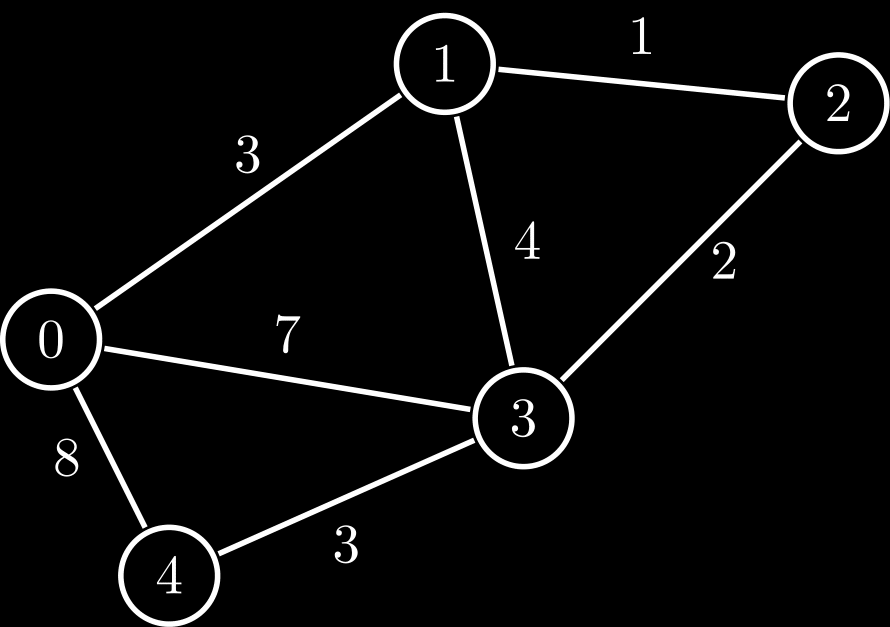
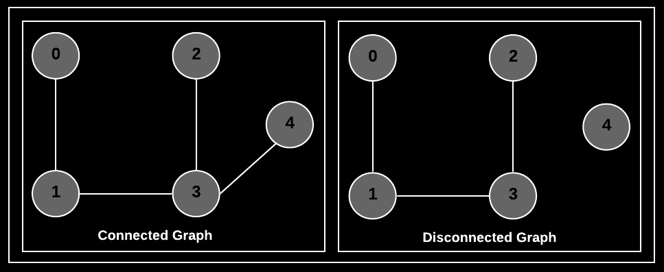
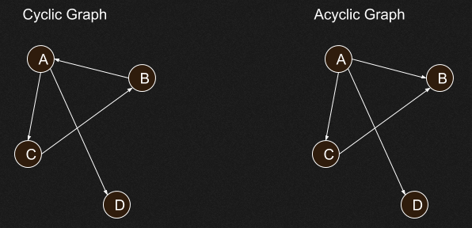
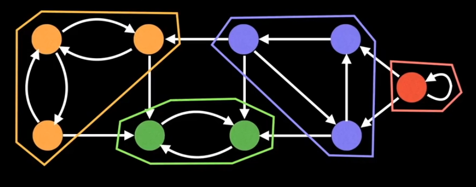

# Trees and Graphs

---

DISCLAIMER: If you don't know what a tree is, don't read the rest of this page.

---

*A Binary Tree is a Tree, but a Tree is not a Binary Tree* - **Spongebob Squarepants**

---

# Trees

    
Binary Tree

* Each node has at most 2 children

    
Binary Search Tree

* It is a binary tree but follows a simple rule
* :large_blue_diamond: all left descendants <= the node <  all right descendants :large_orange_diamond: 
* The equality can appear on the left or right side, depends on the situation

    
Complete Binary Tree

* A Binary Tree in which every level is fully filled, except for the last level
* The last level is filled from left to right

    
Full Binary Tree

* A Binary Tree in which every node has either 0 or 2 child nodes
* :exclamation: None of the node has 1 child

    
Perfect Binary Tree

* A Binary Tree
* which is Complete and Full

:star: It has 2k - 1 nodes, where k = number of levels in the tree

## Binary Heaps

    
Advantages of Heap over Array

* O(logn) to insert in heap, but O(n) to insert in sorted array
* O(logn) to extract min / max from heap, but O(n) in array
* O(1) to find min / max from heap, but O(n) in array

    
Min-heap

* A min-heap is a *complete* binary tree, where each node is smaller than its children
* The root is the minimum element in the tree
* There are 2 key operations on min-heap `insert` and `extract_min`
* [Min Heap Implementation](../0_Basics/MinHeap.cpp)

`insert`
- Insert the new element at the bottomost rightmost spot (as to maintain the complete binary tree property)
- Fix the tree by swapping the new value with its parent till an appropriate spot is found
- Time Complexity - O(logn)

`extract_min`
- Replace the minimum element at the top with the bottommost rightmost element
- Fix the tree by swapping this value with one of the children till the min-heap property is restored
- Time Complexity - O(logn)

    
Max-heap

* A max-heap is a *complete* binary tree, where each node is larger than its children
* The root is the maximum element in the tree
* There are 2 key operations on max-heap `insert` and `extract_max`
* [Max Heap Implementation](../0_Basics/MaxHeap.cpp)

`insert`
- Insert the new element at the bottomost rightmost spot (as to maintain the complete binary tree property)
- Fix the tree by swapping the new value with its parent till an appropriate spot is found
- Time Complexity - O(logn)

`extract_max`
- Replace the maximum element at the top with the bottommost rightmost element
- Fix the tree by swapping this value with one of the children till the max-heap property is restored
- Time Complexity - O(logn)

## Tries

    
What is a Trie ?

* aka Prefix Tree
* It is a type of a search tree
* A trie is an _n-ary_ tree in which characters are stored at each node
* Words can be re _trie_ ved by traversing down a branch

    
Structure

* Each trie has an empty root node, with links to other nodes - one for each possible alphabetic value
* Each node contains an array of pointers to child nodes - one for each possible alphabetic value
* :exclamation:NOTE - The size of the trie is directly correlated to the size of the alphabet being represented by the data structure
* Every node in trie (including the root node) at least has these 2 aspects
    - A value, which might be NULL
    - An array of reference to child nodes which also might be NULL

* [Trie Implementation](../0_Basics/Trie.cpp)

---

## Introduction to Fenwick and Segment Trees

- Consider an `arr[0 ... n-1]`
- We want to do 2 operations on this array
    - Compute the sum of first _i_ elements
    - Modify the value of a specified element `arr[i] = x` where `0 <= i <= n-1`
- Simple solution is to run a loop for calculating sum `O(n)` and modify value by simple indexing, so `O(1)`
- What if we want to perform both operations in `O(logn)`
- Recommended reading: Efficient Bit Operations
- Continue reading

---
## Segment Tree

    
To be updated

## Fenwick Tree / Binary Indexed Tree

    
Representation
 

- It is represented as an array
- Let the array be `BITree[]`
- The size of the Binary Indexed tree is equal to the size of input array

    
Construction
 

- Initialize the `BITree[]` as 0
- Then we call `update()` for all the indexes

    
Operations

There are 2 operations

1. `getSum(x)` - Returns the sum of the subarray `arr[0 ... x]`
    - Initialize the output `sum` as `0`, the current index as `x + 1`
    - Do following while the current index is greater than `0`
        - Add `BITree[index]` to `sum`
        - Go to the parent of `index`
            - How to go to the parent ? By removing the right most set bit
            - `index` = `index - (index & (-index))`
    - Return `sum`
")
2. `update(x, val)` - Update the Binary Indexed Tree by performing `arr[index] += val`, it will make changes to `BITree[]`
    - Initialize current index as `x + 1`
    - Do the following while the current index is smaller than or equal to `n`
        - Add the `val` to `BITree[index]`
        - Go to the next element of `BITree[index]`
            - The next element can be obtained by incrementing the last set bit of the current index
            - `index = index + (index & (-index))`
")

    
Applications

- To get prefix sum of an array in `O(logn)` time
- To update the prefix sum array in `O(logn)` time

[Fenwick Tree Implementation](./FenwickTree.cpp)

---

*A tree is actually a type of graph, but not all graphs are trees* - **Doge**

---

# Graphs

- A tree is a connected graph without cycles.
- A graph is a collection of nodes with edges between them

## Theory

    
Directed and Undirected

- Directed edge, one way
- Undirected edge, two way

    
Weighted

- Every edge has a weight assigned to it

    
Rooted Tree

- It is a tree with a **designated root node**
- Every edge either points away from or towards the root node
- When edges point away from the root -> **arborescence** (out-tree)
- When edges point away from the root -> **anti-arborescence** (in-tree)

    
Connected and Disconnected

- If there is a path from any point to any other point in the graph, it is called a connected graph
- If there exists multiple disconnected vertices and edges, then it is called a disconnected graph

    
Cyclic and Acyclic

- If a graph contains cycles, then it is called a cyclic graph
- A graph containing 0 cycles is an acyclic graph

    
Directed Acyclic Graph (DAGs)

- **Directed graphs with no cycles**
- These graphs play an important role in representing structures with dependencies

    
Bipartite Graph

- A **bipartite graph** is one whose vertices can be split into two independent groups U, V such that every edge connects between U and V

    
Strongly Connected Components

- SCCs can be thought of as self-contained cycles within a directed graph where every vertex in a given cycle can reach every other vertex in the same cycle

---

# Algorithms

## Depth-first Search
[DFS code](./DFS.cpp)

    
What can DFS do?

- Compute a graph's minimum spanning tree
- Detect and find cycles in a graph
- Check if a graph is bipartite
- Find strongly connected components
- Topologically sort the nodes of a graph
- Find bridges and articulation points
- Find augmenting paths in a flow network
- Generate mazes

    
Time Complexity

`O(V + E)`

---

## Breadth-first Search
[BFS code](./BFS.cpp)

    
What can BFS do?

- Find shortest path on unweighted graph
- Number of Islands in a grid, quite popular problem

    
Time Complexity

`O(V + E)`

---

## Topological Sort
[Topological Sort Code](./TopologicalSort.cpp)
- It is only for Directed Acyclic Graphs (DAG)
- It is a linear ordering of vertices such that for every directed edge _(u,v)_ , vertex _u_ comes before _v_ in the ordering
- Time Complexity = `O(V + E)`

    
Applications

- School class prerequisites
- Program dependencies
- Event Scheduling
- Assembly Instructions

---

## Single-Source Shortest Path in a DAG
[SSSPDAG Code](./ShortestPathDAG.cpp)
- Popular application of Topological Sort
- Find the shortest path from one given source node to every other node in the graph
- Only valid for DAGs though

---

## Dijkstra's Algorithm
[Dijkstra's Code](./DijkstrasAlgorithm.cpp)

    
Algorithm

- Maintain a 'dist' array where the distance to every node is +ve infinity. Mark the distance to the start node 's' to be 0.
- Maintain a PQ of key-value pairs of (node_index, distance) pairs which tell you which node to visit next based on sorted min value.
- Insert (s,0) into the PQ and loop while PQ is not empty pulling out the next most promising (node_index, distance) pair.
- Iterate over all edges outwards from the current node and relax each edge appending a new (node_index, distance) key-value pair to the PQ for every relaxation.

---

- SSSP Algorithm for graphs with **non-negative edge weights**
- Time Complexity = `O(E * log(V))`
- :warning: NOTE: One constraint for Dijkstra's algorithm is that the graph must contain **non-negative edge weights**.
- This constraint is imposed to ensure that once a node has been visited its optimal distance cannot be improved
- This property enables Dijkstra's algorithm to act in a greedy manner by always selecting the next most promising node

---

## Bellman-Ford Algorithm
[Bellman-Ford code](./BellmanFord.cpp)

    
Algorithm

- v = number of nodes in the graph
- e = number of edges in the graph
- s = starting node
- dist[] = distance to each node from 's'
- Maintain a 'dist' array of size v, initially the distance to each node is +ve infinity
- Set the distance to starting node as 0
- Relax each edge v-1 times
- Why v-1 times? Because we don't know the sequence in which the edges will be processed, since the longest path can be v-1 nodes long, to consider all the edges we run it v-1 times.
- For more clarification [Why do we need to relax all the edges v-1 times in Bellman-Ford?](https://riptutorial.com/algorithm/example/24029/why-do-we-need-to-relax-all-the-edges-at-most--v-1--times)

---
- SSSP algorithm that can **detect negative cycles**
- Time Complexity - `O(EV)`
- When to use? When the graph has negative cycles because Dijkstra's can't handle negative edge weights

---

# Bridges and Articulation Points

## Bridge
A bridge/cut edge is any **edge** in a graph whose removal increases the number of connected components

## Articulation point
An articulation point/cut vertex is any **node** in a graph whose removal increases the number of connected components

```mermaid
flowchart LR
node0((0))
node1((1))
node2((2))
node3((3))
node4((4))
node5((5))
node6((6))
node7((7))
node8((8))

node0 --- node1
node0 --- node2
node1 --- node2
node2 --- node3
node3 --- node4
node2 --- node5
node5 --- node6
node5 --- node8
node6 --- node7
node7 --- node8
```

In the above graph
*Bridges - {2,3}, {3,4}, {2,5}* and
*Articulation points - {2}, {5}, {3}*

## Significance of bridges and articulation points
Bridges and articulation points are important because they often hint at *weak points*, *bottlenecks* or *vulnerabilities* in a graph. Therefore it is important to be able to quickly find/detect when and where these occur.

## Low-link value
The low-link value of a node is the smallest (lowest) id reachable from that node when doing a DFS (including itself)

## Tarjans Algorithm for finding bridges
Code - [Find Bridges](./FindBridgesInAGraph.cpp)