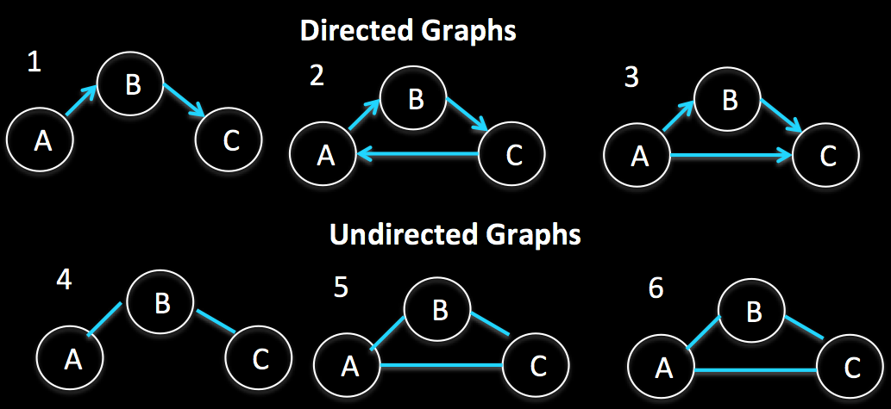
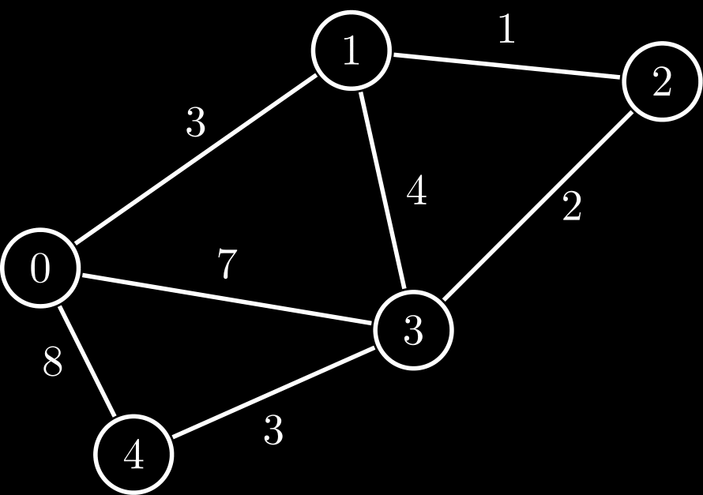
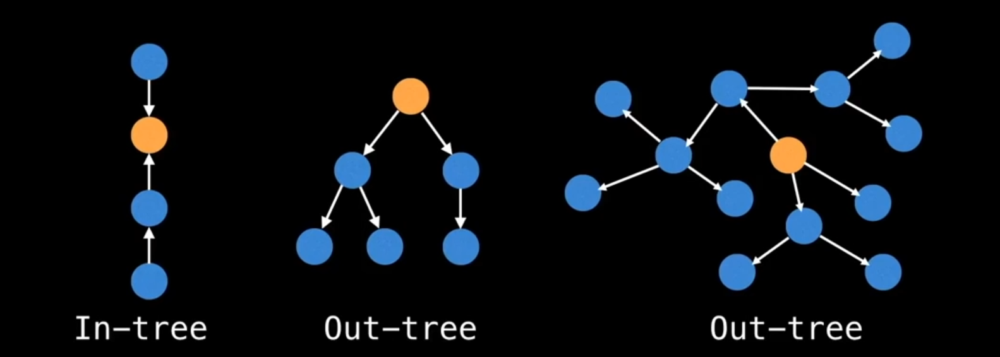
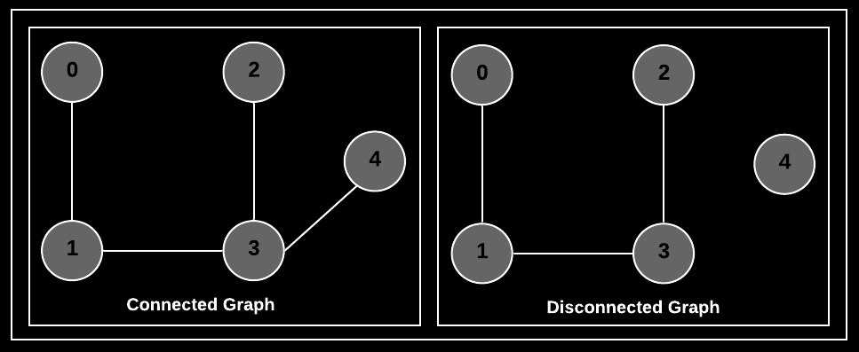
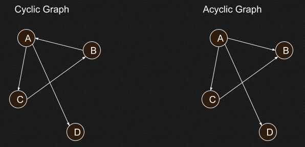
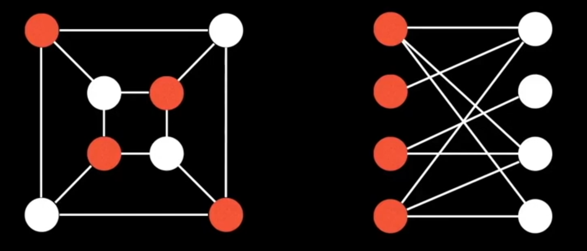
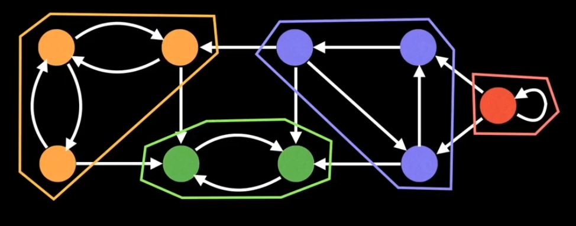

# Trees and Graphs

---

DISCLAIMER: If you don't know what a tree is, don't read the rest of this page.

---

*A Binary Tree is a Tree, but a Tree is not a Binary Tree* - **Spongebob Squarepants**

---

# Trees

    
Binary Tree

* Each node has at most 2 children

    
Binary Search Tree

* It is a binary tree but follows a simple rule
* :large_blue_diamond: all left descendants <= the node <  all right descendants :large_orange_diamond: 
* The equality can appear on the left or right side, depends on the situation

    
Complete Binary Tree

* A Binary Tree in which every level is fully filled, except for the last level
* The last level is filled from left to right

    
Full Binary Tree

* A Binary Tree in which every node has either 0 or 2 child nodes
* :exclamation: None of the node has 1 child

    
Perfect Binary Tree

* A Binary Tree
* which is Complete and Full

:star: It has 2k - 1 nodes, where k = number of levels in the tree

## Binary Heaps

    
Advantages of Heap over Array

* O(logn) to insert in heap, but O(n) to insert in sorted array
* O(logn) to extract min / max from heap, but O(n) in array
* O(1) to find min / max from heap, but O(n) in array

    
Min-heap

* A min-heap is a *complete* binary tree, where each node is smaller than its children
* The root is the minimum element in the tree
* There are 2 key operations on min-heap `insert` and `extract_min`
* [Min Heap Implementation](https://github.com/akormous/super-pro-dsa/blob/master/0_Basics/MinHeap.cpp)

`insert`
- Insert the new element at the bottomost rightmost spot (as to maintain the complete binary tree property)
- Fix the tree by swapping the new value with its parent till an appropriate spot is found
- Time Complexity - O(logn)

`extract_min`
- Replace the minimum element at the top with the bottommost rightmost element
- Fix the tree by swapping this value with one of the children till the min-heap property is restored
- Time Complexity - O(logn)

    
Max-heap

* A max-heap is a *complete* binary tree, where each node is larger than its children
* The root is the maximum element in the tree
* There are 2 key operations on max-heap `insert` and `extract_max`
* [Max Heap Implementation](https://github.com/akormous/super-pro-dsa/blob/master/0_Basics/MaxHeap.cpp)

`insert`
- Insert the new element at the bottomost rightmost spot (as to maintain the complete binary tree property)
- Fix the tree by swapping the new value with its parent till an appropriate spot is found
- Time Complexity - O(logn)

`extract_max`
- Replace the maximum element at the top with the bottommost rightmost element
- Fix the tree by swapping this value with one of the children till the max-heap property is restored
- Time Complexity - O(logn)

## Tries

    
What is a Trie ?

* aka Prefix Tree
* It is a type of a search tree
* A trie is an _n-ary_ tree in which characters are stored at each node
* Words can be re _trie_ ved by traversing down a branch

    
Structure

* Each trie has an empty root node, with links to other nodes - one for each possible alphabetic value
* Each node contains an array of pointers to child nodes - one for each possible alphabetic value
* :exclamation:NOTE - The size of the trie is directly correlated to the size of the alphabet being represented by the data structure
* Every node in trie (including the root node) at least has these 2 aspects
    - A value, which might be NULL
    - An array of reference to child nodes which also might be NULL

* [Trie Implementation](https://github.com/akormous/super-pro-dsa/blob/master/0_Basics/Trie.cpp)

---

## Introduction to Fenwick and Segment Trees

- Consider an `arr[0 ... n-1]`
- We want to do 2 operations on this array
    - Compute the sum of first _i_ elements
    - Modify the value of a specified element `arr[i] = x` where `0 <= i <= n-1`
- Simple solution is to run a loop for calculating sum `O(n)` and modify value by simple indexing, so `O(1)`
- What if we want to perform both operations in `O(logn)`
- Recommended reading: Efficient Bit Operations
- Continue reading

---
## Segment Tree

    
To be updated

## Fenwick Tree / Binary Indexed Tree

    
Representation
 

- It is represented as an array
- Let the array be `BITree[]`
- The size of the Binary Indexed tree is equal to the size of input array

    
Construction
 

- Initialize the `BITree[]` as 0
- Then we call `update()` for all the indexes

    
Operations

There are 2 operations

1. `getSum(x)` - Returns the sum of the subarray `arr[0 ... x]`
    - Initialize the output `sum` as `0`, the current index as `x + 1`
    - Do following while the current index is greater than `0`
        - Add `BITree[index]` to `sum`
        - Go to the parent of `index`
            - How to go to the parent ? By removing the right most set bit
            - `index` = `index - (index & (-index))`
    - Return `sum`
")
2. `update(x, val)` - Update the Binary Indexed Tree by performing `arr[index] += val`, it will make changes to `BITree[]`
    - Initialize current index as `x + 1`
    - Do the following while the current index is smaller than or equal to `n`
        - Add the `val` to `BITree[index]`
        - Go to the next element of `BITree[index]`
            - The next element can be obtained by incrementing the last set bit of the current index
            - `index = index + (index & (-index))`
")

    
Applications

- To get prefix sum of an array in `O(logn)` time
- To update the prefix sum array in `O(logn)` time

[Fenwick Tree Implementation](https://github.com/akormous/super-pro-dsa/blob/master/5_Trees_and_Graphs/FenwickTree.cpp)

---

*A tree is actually a type of graph, but not all graphs are trees* - **Doge**

---

# Graphs

- A tree is a connected graph without cycles.
- A graph is a collection of nodes with edges between them

## Theory

    
Directed and Undirected

- Directed edge, one way
- Undirected edge, two way

    
Weighted

- Every edge has a weight assigned to it

    
Rooted Tree

- It is a tree with a **designated root node**
- Every edge either points away from or towards the root node
- When edges point away from the root -> **arborescence** (out-tree)
- When edges point away from the root -> **anti-arborescence** (in-tree)

    
Connected and Disconnected

- If there is a path from any point to any other point in the graph, it is called a connected graph
- If there exists multiple disconnected vertices and edges, then it is called a disconnected graph

    
Cyclic and Acyclic

- If a graph contains cycles, then it is called a cyclic graph
- A graph containing 0 cycles is an acyclic graph

    
Directed Acyclic Graph (DAGs)

- **Directed graphs with no cycles**
- These graphs play an important role in representing structures with dependencies

    
Bipartite Graph

- A **bipartite graph** is one whose vertices can be split into two independent groups U, V such that every edge connects between U and V

    
Strongly Connected Components

- SCCs can be thought of as self-contained cycles within a directed graph where every vertex in a given cycle can reach every other vertex in the same cycle

---

## Topological Sort
- It is only for Directed Acyclic Graphs (DAG)
- It is a linear ordering of vertices such that for every directed edge _(u,v)_ , vertex _u_ comes before _v_ in the ordering

    
Applications

- Finding the order of installation of dependencies in any project (Software, Hardware, Automobile Manufacturing and whatever you can think of as a DAG)

