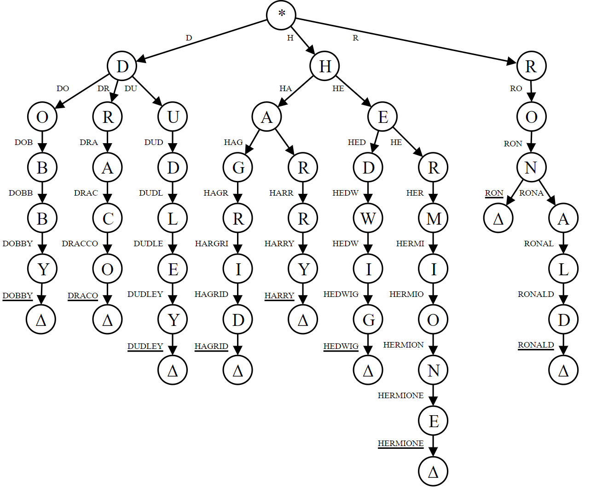

# Trees and Graphs

---

DISCLAIMER: If you don't know what a tree is, don't read the rest of this page.

---

*A Binary Tree is a Tree, but a Tree is not a Binary Tree* - **Spongebob Squarepants**

---

# Trees

    
Binary Tree

* Each node has at most 2 children

    
Binary Search Tree

* It is a binary tree but follows a simple rule
* :large_blue_diamond: all left descendants <= the node <  all right descendants :large_orange_diamond: 
* The equality can appear on the left or right side, depends on the situation

    
Complete Binary Tree

* A Binary Tree in which every level is fully filled, except for the last level
* The last level is filled from left to right

    
Full Binary Tree

* A Binary Tree in which every node has either 0 or 2 child nodes
* :exclamation: None of the node has 1 child

    
Perfect Binary Tree

* A Binary Tree
* which is Complete and Full

:star: It has 2k - 1 nodes, where k = number of levels in the tree

## Binary Heaps

    
Advantages of Heap over Array

* O(logn) to insert in heap, but O(n) to insert in sorted array
* O(logn) to extract min / max from heap, but O(n) in array
* O(1) to find min / max from heap, but O(n) in array

    
Min-heap

* A min-heap is a *complete* binary tree, where each node is smaller than its children
* The root is the minimum element in the tree
* There are 2 key operations on min-heap `insert` and `extract_min`
* [Min Heap Implementation](https://github.com/akormous/super-pro-dsa/blob/master/0_Basics/MinHeap.cpp)

`insert`
- Insert the new element at the bottomost rightmost spot (as to maintain the complete binary tree property)
- Fix the tree by swapping the new value with its parent till an appropriate spot is found
- Time Complexity - O(logn)

`extract_min`
- Replace the minimum element at the top with the bottommost rightmost element
- Fix the tree by swapping this value with one of the children till the min-heap property is restored
- Time Complexity - O(logn)

    
Max-heap

* A max-heap is a *complete* binary tree, where each node is larger than its children
* The root is the maximum element in the tree
* There are 2 key operations on max-heap `insert` and `extract_max`
* [Max Heap Implementation](https://github.com/akormous/super-pro-dsa/blob/master/0_Basics/MaxHeap.cpp)

`insert`
- Insert the new element at the bottomost rightmost spot (as to maintain the complete binary tree property)
- Fix the tree by swapping the new value with its parent till an appropriate spot is found
- Time Complexity - O(logn)

`extract_min`
- Replace the maximum element at the top with the bottommost rightmost element
- Fix the tree by swapping this value with one of the children till the max-heap property is restored
- Time Complexity - O(logn)

## Tries

    
What is a Trie ?

* aka Prefix Tree
* It is a type of a search tree
* A trie is an _n-ary_ tree in which characters are stored at each node
* Words can be re _trie_ ved by traversing down a branch

    
Structure

* Each trie has an empty root node, with links to other nodes - one for each possible alphabetic value
* Each node contains an array of pointers to child nodes - one for each possible alphabetic value
* :exclamation:NOTE - The size of the trie is directly correlated to the size of the alphabet being represented by the data structure
* Every node in trie (including the root node) at least has these 2 aspects
    - A value, which might be NULL
    - An array of reference to child nodes which also might be NULL

* [Trie Implementation](https://github.com/akormous/super-pro-dsa/blob/master/0_Basics/Trie.cpp)

---

*A tree is actually a type of graph, but not all graphs are trees* - **Doge**

---

# Graphs

- A tree is a connected graph without cycles.
- A graph is a collection of nodes with edges between them

    
Directed and Undirected

- Directed edge, one way
- Undirected edge, two way

    
Connected and Disconnected

- If there is a path from any point to any other point in the graph, it is called a connected graph
- If there exists multiple disconnected vertices and edges, then it is called a disconnected graph

    
Cyclic and Acyclic

- If a graph contains cycles, then it is called a cyclic graph
- A graph containing 0 cycles is an acyclic graph

